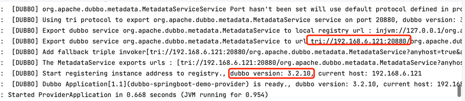
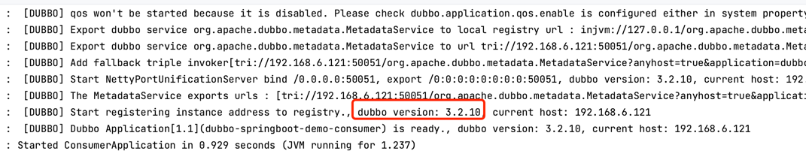
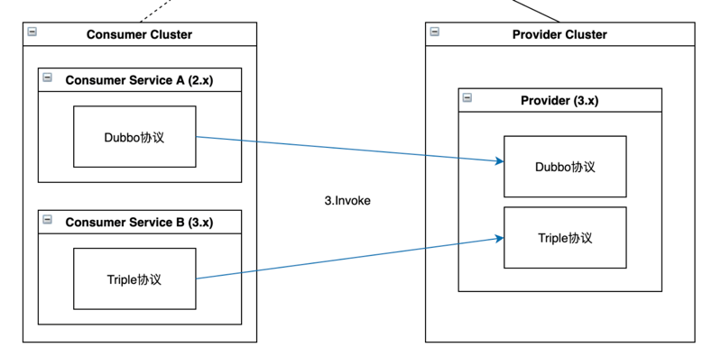
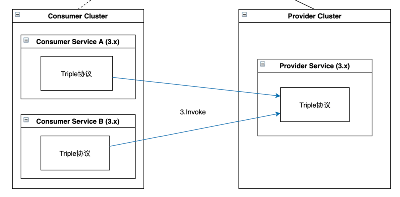

# 无注册中心 Dubbo2 协议迁移流程

Dubbo2 的用户使用 dubbo 协议 + 自定义序列化，如 hessian2 完成远程调用。

而 Grpc 的默认仅支持 Protobuf 序列化，对于 Java 语言中的多参数以及方法重载也无法支持。

Dubbo3的之初就有一条目标是完美兼容 Dubbo2，所以为了 Dubbo2 能够平滑升级， Dubbo 框架侧做了很多工作来保证升级的无感，目前默认的序列化和
Dubbo2 保持一致为hessian2。

所以，如果决定要升级到 Dubbo3 的 Triple 协议，只需要修改配置中的协议名称为 tri (注意: 不是triple)即可。

接下来我们我们以一个使用 Dubbo2 协议的工程 来举例，如何一步一步安全的升级。

## 1. 修改pom文件

将dubbo版本从2.x变更为3.x

[pom.xml](pom.xml)

```xml

<dependencyManagement>
    <dependencies>
        <dependency>
            <groupId>org.apache.dubbo</groupId>
            <artifactId>dubbo-bom</artifactId>
            <version>3.2.10</version>
            <type>pom</type>
            <scope>import</scope>
        </dependency>
    </dependencies>
</dependencyManagement>
```

## 2. 修改provider下配置文件

[application.yml](dubbo-spring-boot-provider%2Fsrc%2Fmain%2Fresources%2Fapplication.yml)

```yaml
dubbo:
  application:
    name: dubbo-springboot-demo-provider
  protocol:
    name: tri
    ext-protocol: dubbo, #多协议 参考 https://cn.dubbo.apache.org/zh-cn/overview/tasks/protocols/multi-protocols/
    port: 20880
```

## 3. 修改consumer下@DubboReference 下 url 下协议

[DemoController.java](dubbo-spring-boot-consumer%2Fsrc%2Fmain%2Fjava%2Fio%2Fdaocloud%2Fcontroller%2FDemoController.java)

```
before
@DubboReference(url = "dubbo://127.0.0.1:20880")

after
@DubboReference(url = "tri://127.0.0.1:20880")
```

## 4. 启动

providerApplication


consumerApplication


# 建议的安全升级步骤

## 1. 仅使用 dubbo 协议启动 provider 和 consumer，并完成调用

为保证兼容性，我们先将部分 provider 升级到 dubbo3 版本并使用 dubbo 协议。

使用 dubbo 协议启动一个 Provider 和 Consumer。

## 2. 使用 dubbo 和 tri 协议 启动provider，以 dubbo 协议启动 consumer，并完成调用

对于线上服务的升级，不可能一蹴而就同时完成 provider 和 consumer 升级, 需要按步操作，保证业务稳定。 第二步, provider 提供双协议的方式同时支持 dubbo + tri 两种协议的客户端。



**按照推荐升级步骤，provider 已经支持了tri协议，所以 dubbo3的 consumer 可以直接使用 tri 协议**

## 仅使用 tri 协议 启动 provider和 consumer，并完成调用

当所有的 consuemr 都升级至支持 Triple 协议的版本后，provider 可切换至仅使用 Triple 协议启动

