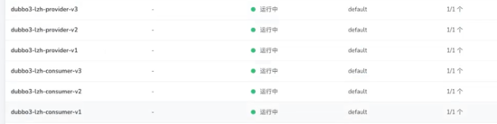
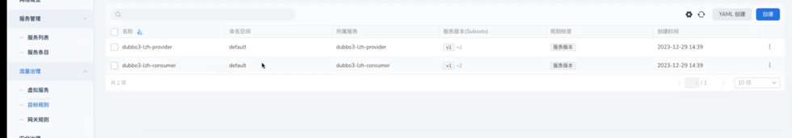
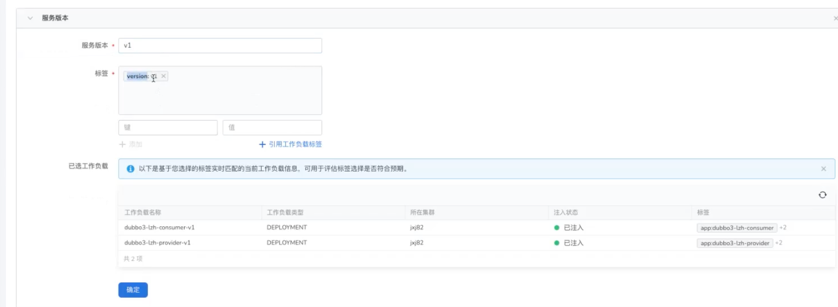
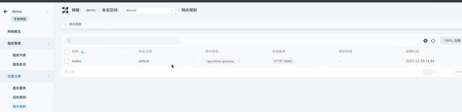
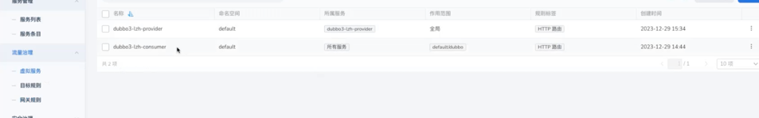
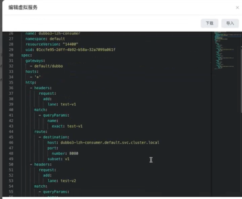

# 如何demo实现使用bu染色

## 部署三个版本consumer和provider

基于同一镜像部署
每个不同的版本添加不同的label
例如： consumer-v1就添加version: v1标签

## 在网格中创建目标规则

在目标规则中为consumer和provider分别添加对应配置

每个规则中添加3个版本

## 添加网关规则

创建网关规则监听所有域名

## 添加虚拟服务

在虚拟服务中为consumer和provider分别添加对应配置

### 配置consumer
在http head中匹配到请求参数为test-v1时路由到consumer的v1版本,并且在请求的http head中添加head为lane: test-v1  
另外两个版本配置一致

参考图：

### 配置provider

在provider中配置将带有lane请求头的http请求通过其中不同的value值路由到不同版本的后端中去

参考图:

## 配置完成
总体链路为 gateway -> consumer -> provider